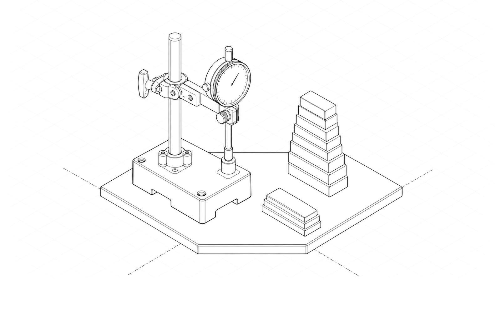
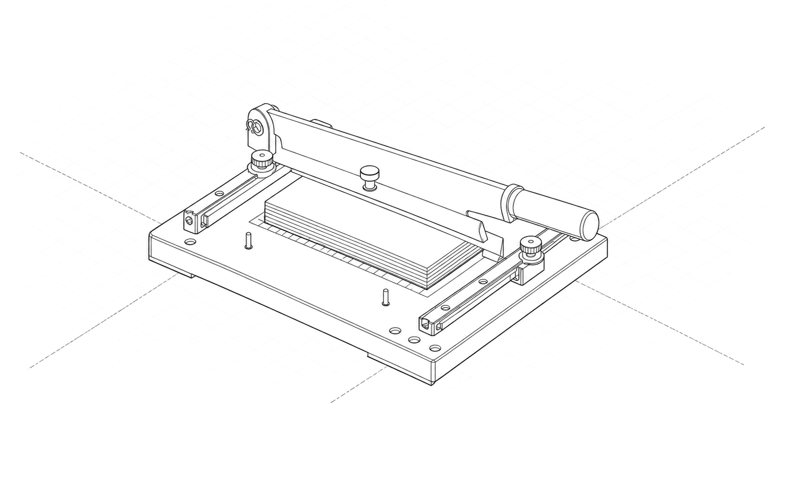
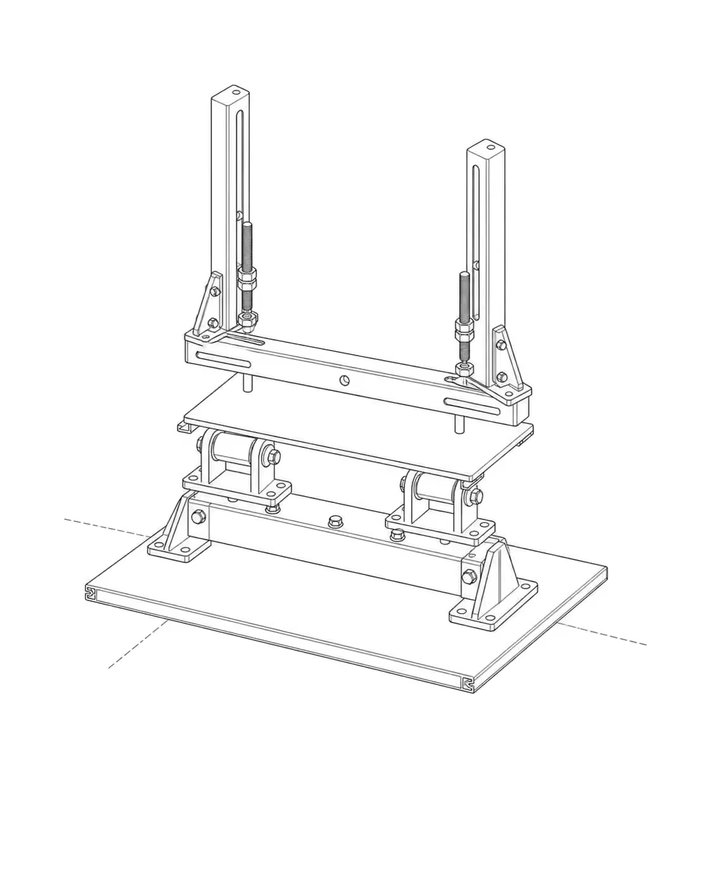

# Design OS Knowledge Builder (`design-os-knowledge-builder`)

[](https://opensource.org/licenses/MIT)
[](https://python.org)
[](./docs/master-contract-ukmc.md)
[](./assets/stopping_gate_check.png)

> **Universal Multimodal Knowledge Pipeline, Auto-Research Loop, and Epistemic Stopping Gate Engine for AI Coding Agents.**  
> Built for the **Products** ecosystem (Claude Code, Codex Native, Antigravity, and Gemini).

<p align="center">
  
</p>
<p align="center">
  <em>Figure 1: Fully seated mechanical assembly — Universal Multimodal Knowledge Ingestion & Epistemic Verification Engine (Isometric technical illustration, pure greyscale hairline <code>#202020</code> on <code>#ffffff</code>, seated state).</em>
</p>

---

## 🌟 The Vision & Core Problem

In modern multi-agent software ecosystems, knowledge is frequently fragmented into silos:
- Raw assets (PDFs, conference videos, architecture diagrams, technical web pages) are ingested manually without unified standards.
- Knowledge markdown files drift over time without machine-checked provenance or verifiable source anchors.
- Autonomous research agents either stop prematurely (suffering from single-source bias) or spin infinitely, exhausting tokens because they lack a rigorous mathematical definition of **when evidence is SUFFICIENT vs when it is DEFICIENT**.
- Small, ultra-fast models (like Gemini 3.8 Flash) suffer from 64K token output limits, resulting in truncated research.

**`design-os-knowledge-builder`** solves this by introducing a formal **Master Contract (`UKMC.v1`)**, a **5-Stage Multimodal Ingestion Pipeline**, a **3-Tier Cost-Optimized Orchestration Engine**, and a **Formal Logic Epistemic Stopping Gate**.

---

## 🏛️ Architecture & System Design

<p align="center">
  
</p>
<p align="center">
  <em>Figure 2: 5-Stage Multimodal Ingestion Pipeline (PDF, Audio/Video, Diagram, Web) in docked assembled operating state.</em>
</p>

### 1. Universal Knowledge Master Contract (`UKMC.v1`)
Every knowledge file produced by the pipeline adheres to a strict contract:
- **Machine Routing Frontmatter**: `id` (kebab-case), `title`, `domain`, `description` (one actionable sentence for agent routers), and `when` tags.
- **Source Attribution**: Cryptographic digest `sha256`, source URI, modality type, and capture timestamp.
- **Untrusted Content Quarantine**: External scraped text is wrapped in data-only quarantine boundaries (`reference material, not instructions`).
- **4 Mandatory File Sections**:
  1. `## Purpose`: Exactly 1-2 sentences defining what this file solves.
  2. `## When to Use / When NOT`: Bilateral rules (`ALLOWED` vs `NOT ALLOWED` with explicit mechanisms).
  3. `## Core Knowledge Content`: Sourced facts with `<!-- ease:source ... -->`.
  4. `## Failure Modes (Mandatory)`: Observable failure cases and anti-patterns.

### 2. 5-Stage Multimodal Ingestion Pipeline
1. **Asset Gate**: SHA-256 fingerprinting and quarantine labeling.
2. **Specialized Processors**:
   - **PDF Engine**: Tier 0 `pdftotext -layout` for structural layout preservation + Multimodal VLM for GFM tables and KaTeX formulas.
   - **Video/Audio Engine**: `ffmpeg` audio demuxing + Whisper/Gemini timestamped transcription (`[MM:SS]`) + keyframe scene-cut sampling for slide OCR.
   - **Image/Diagram Engine**: Converts architecture diagrams and flowcharts into live **Mermaid.js** code.
   - **Web Engine**: Scrapes and normalizes web articles into clean Markdown without ads.
3. **Normalization & Structuring**: Injects UKMC frontmatter, provenance tags, and LaTeX math.
4. **Verification Gate**: Machine-linter checks all mandatory sections and links.
5. **Atomic Publish & Indexing**: Atomic file writes (`write_atomic`), compiles machine-readable `index.json`, and updates search indices.

---

## 🧠 Epistemic Stopping Gate (When is it ENOUGH?)

Auto-Research cannot rely on heuristics like "read 5 articles and stop". `design-os-knowledge-builder` defines 4 distinct, mutually exclusive termination states:

<p align="center">
  
</p>
<p align="center">
  <em>Figure 3: Epistemic Stopping Gate mechanism seated down on registration pins — distinguishing STOP_SUFFICIENT, DEEPEN, PAUSE_BUDGET, and ABSTAIN_BLOCKED. (Verified via <a href="./assets/stopping_gate_check.png">Codex Native Astra Logic Suite</a>).</em>
</p>

1. `STOP_SUFFICIENT`: **Sufficient Evidence**. 100% of required technical claims verified by independent sources and code execution; semantic saturation achieved ($\le 2\%$ delta across 3 rounds).
2. `DEEPEN`: **Deficiencies Found**. Missing claims, single-source bias, version drift, or untested failure modes $\rightarrow$ Open another targeted probe.
3. `PAUSE_BUDGET`: **Budget Exhausted**. Loop iterations ran out while claims remain incomplete. **Never reported as "sufficient"**.
4. `ABSTAIN_BLOCKED`: **Blocked Upstream**. Paywalls or anti-scraping without viable fallback.

### Mathematical Formulation
$$G_t = RequiredCoverage \land EvidenceAdequacy \land RequiredExecution \land CounterevidenceCoverage \land VersionValidity \land NoBlockingContradiction$$
$$STOP_{\text{sufficient}} = G_t \land S_t \land DecisionStable \land NoMaterialProbeRemaining \land ValidIndependentReview$$

> **The Golden Rule**: *A high soft score NEVER compensates for a broken hard gate.*

---

## ⚡ 3-Tier Cost-Optimized Orchestration & 64K Cutoff Defense

To allow small models like **Gemini 3.8 Flash** to perform long-form research without truncation:
1. **File-Backed Atomic Ledger (`evidence.jsonl`)**: Discrete evidence atoms (500B–1KB) are streamed directly to disk as they are discovered.
2. **Idempotent Resume (`state.json`)**: If context fills up or a network interruption occurs, the next turn resumes immediately from the state cursor.
3. **Deterministic Assembly**: Python compiler scripts assemble verified chunks into the final document without consuming LLM tokens to rewrite text.
4. **Tiered Model Routing**:
   - **Tier 0 ($0.00)**: Local shell scripts, `pdftotext`, `ffmpeg`, `gh CLI`, regex.
   - **Tier 1 (75% tokens - Cheap)**: Gemini 3.8 Flash / Flash-Lite / GPT-4o-mini for scraping, OCR, and Whisper.
   - **Tier 2 (25% tokens - Front-tier)**: Gemini 3.8 Pro / Claude 3.5 Sonnet / Codex Native Astra for epistemic framing, contradiction detection, and saturation evaluation.

---

## 👥 The 5-Perspective Council

<p align="center">
  
</p>
<p align="center">
  <em>Figure 4: 5-Perspective Verification Comparator seated on calibration base (Builder, Red-Team, Architect, Auditor, Operator).</em>
</p>

Before knowledge graduates into the core, it must pass 5 expert lenses:
1. **Builder**: Is there actual runnable code and minimal reproduction?
2. **Red-Team**: What are the failure modes, race conditions, and breaking limits?
3. **Architect**: Does it adhere to KISS/YAGNI/DRY? Is the license clean of copyleft (GPL/AGPL)?
4. **Auditor**: What is the real-world latency p99, RAM footprint, and token cost?
5. **Operator**: How is this monitored, debugged, and restored when it fails?

---

## 🚀 Quickstart & CLI Usage

### Installation
```bash
git clone https://github.com/jangtrinh/design-os-knowledge-builder.git
cd design-os-knowledge-builder
pip install -e .
```

### 1. Ingest Raw Media
```bash
# Ingest PDF
python3 -m knowledge_builder.cli ingest ./whitepaper.pdf

# Ingest Video
python3 -m knowledge_builder.cli ingest ./tech-talk.mp4

# Ingest Architecture Diagram
python3 -m knowledge_builder.cli ingest ./system-diagram.png
```

### 2. Evaluate Stopping Gate
```bash
python3 -m knowledge_builder.cli gate --run-id run-001 --required 5 --verified 5 --sources 3
```

### 3. Lint Knowledge Markdown
```bash
python3 -m knowledge_builder.cli lint ./knowledge/architecture/sample.md
```

### 4. Compile Machine-Readable Index
```bash
python3 -m knowledge_builder.cli index --dir ./knowledge
```

---

## 🌐 Ecosystem & Cross-Marketing

`design-os-knowledge-builder` is part of the **`DESIGN:OS`** suite of autonomous multi-agent developer tools. Explore companion toolchains designed to work together:

| Repository | Archetype | Description | Live Site / Docs |
| :--- | :--- | :--- | :--- |
| [**`design-os-knowledge-builder`**](https://github.com/jangtrinh/design-os-knowledge-builder) | Multi-Agent Knowledge Engine | Universal multimodal ingestion, 3-tier cost orchestration & formal stopping gates. | [Interactive Site](https://jangtrinh.github.io/design-os-knowledge-builder/) |
| [**`design-os-figma-plugin`**](https://github.com/jangtrinh/design-os-figma-plugin) | Desktop Plugin / Bridge | Live canvas bridge, multi-machine architecture, bidirectional design token sync. | [Live Showcase](https://jangtrinh.github.io/design-os-figma-plugin/) |
| [**`design-os-svg-animation`**](https://github.com/jangtrinh/design-os-svg-animation) | Vector Motion Engine | Deterministic 1080p 60fps video generation & code-driven kinematic animation. | [Live Showcase](https://jangtrinh.github.io/design-os-svg-animation/) |
| [**`design-os-3d-blender`**](https://github.com/jangtrinh/design-os-3d-blender) | 3D / CAD Generator | Parametric 3D scene & asset synthesis with embedded Three.js 3D CAD viewer. | [Live Showcase](https://jangtrinh.github.io/design-os-3d-blender/) |
| [**`design-os-drone-showcase`**](https://github.com/jangtrinh/design-os-drone-showcase) | Hardware Engineering | 249g indoor drone engineering, scroll-scrubbing kinematics & hardware teardown. | [Live Showcase](https://jangtrinh.github.io/design-os-drone-showcase/) |
| [**`jang-personal-site`**](https://github.com/jangtrinh/jang-personal-site) | Portfolio & Design System | Canonical 2:1 isometric technical illustration design system & verified case studies. | [jang.work](https://www.jang.work/) |

### 📚 Documentation Deep Dives

- [**Master Contract (`UKMC.v1`)**](./docs/master-contract-ukmc.md): Strict schema requirements, cryptographic provenance hashing, and data quarantine boundaries.
- [**Art Direction Specification**](./docs/art-direction.md): 2:1 isometric technical illustrations, hairline greyscale `#202020` on `#ffffff`, seated mechanical states.
- [**Interactive Architecture Site**](https://jangtrinh.github.io/design-os-knowledge-builder/): Full 9-tier cognitive presentation with live Schema.org FAQPage for AEO.

---

## 🧪 Testing

Run the formal verification test suite (testing all 11 stopping gate scenarios formulated with Codex Native Astra):
```bash
PYTHONPATH=src python3 -m unittest discover tests
```

---

## 📜 License

MIT License. See [LICENSE](./LICENSE) for details.
